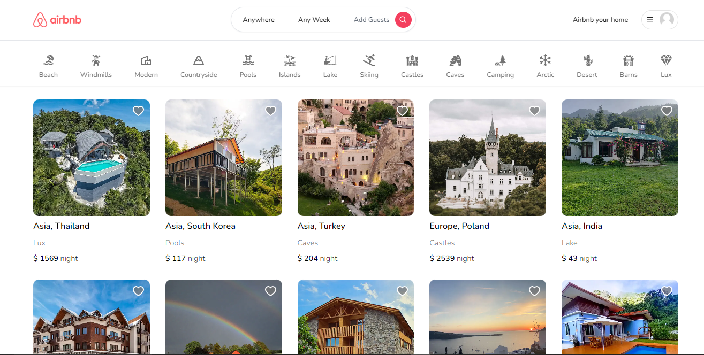

# Full Stack Airbnb Clone with Next.js 13 App Router: React, Tailwind, Prisma, MongoDB, NextAuth 2023


<table>
    <tr>
        <td>
<a href="#"></a>
        </td>
                <td>
<a href="#"></a>
        </td>
                        <td>
<a href="#"></a>
        </td>
                              <td>
<a href="#"></a>
        </td>
                        <td>
<a href="#"></a>
        </td>
                                <td>
<a href="#"></a>
        </td>
                                      <td>
<a href="#"></a>
        </td>
      <td>
<a href="#"></a>
        </td>
        <td>
<a href="#"></a>
        </td>
    </tr>
</table>

Features:

- Tailwind design
- Tailwind animations and effects
- Full responsiveness
- Credential authentication
- Google authentication
- Github authentication
- Image upload using Cloudinary CDN
- Client form validation and handling using react-hook-form
- Server error handling using react-toast
- Calendars with react-date-range
- Page loading state
- Page empty state
- Booking / Reservation system
- Guest reservation cancellation
- Owner reservation cancellation
- Creation and deletion of properties
- Pricing calculation
- Advanced search algorithm by category, date range, map location, number of guests, rooms and bathrooms
- For example we will filter out properties that have a reservation in your desired date range to travel
- Favorites system
- Shareable URL filters

### Prerequisites

**Node version 14.x**

### Cloning the repository

```shell
git clone https://github.com/Crypt06545/Airbnb-Clone.git
```

## Sneak Peek of Home Page 🙈 :


<table>
  <tr>
    <td></td>
    <td></td>
  </tr>
  <tr>
    <td></td>
    <td></td>
  </tr>
</table>


### Install packages

```shell
npm i
```

### Setup .env file


```js
DATABASE_URL=
GOOGLE_CLIENT_ID=
GOOGLE_CLIENT_SECRET=
GITHUB_ID=
GITHUB_SECRET=
NEXTAUTH_SECRET=
```

### Setup Prisma

```shell
npx prisma generate
npx prisma db push

```

### Start the app

```shell
npm run dev
```

